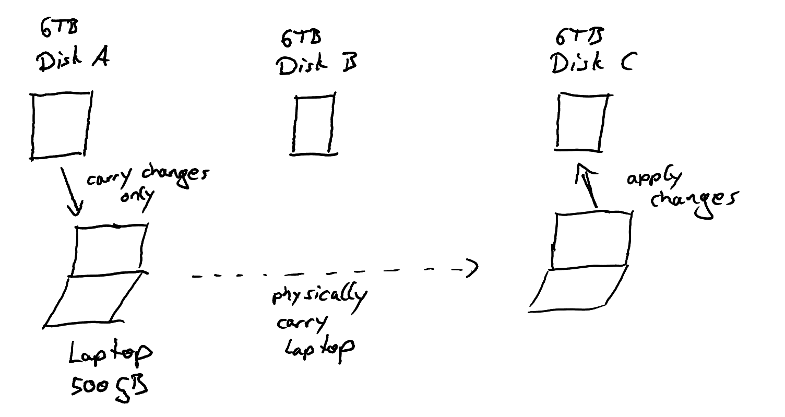

[](https://github.com/FritzFlorian/data_squirrel/actions/workflows/test.yml)

# WIP: Data Squirrel

WARNING: This project is a WORK IN PROGRESS file synchronization tool. Do not use it on any of your
data in its current state.

## Goal

The goal is to create a file-sync tool that can keep big file vaults spread across external hard drives
in sync by carrying only the changes on a laptop that sporadically is connected to the external hard drives. 



The important aspect is that the 'carrying laptop' has far less capacity than the overall data collection stored
on the external drives.

NOTE: This project is foremost for my own education. I plan to use a variant of version vectors to achieve 
the above goal of synchronizing the data stores. There are probably better 'simple' solutions where the
laptop simply indexes all external drives. I mainly use version vectors out of curiosity to build something
using optimistic replication.

## Usage

The basic usage involves creating multiple data stores (synced folders) with the same name.
They can then be indexed for changes on disk.
When a folder is fully indexed, it can be synced with any other folder.
The version vector pair algorithm detects any conflicts (resolution is currently not exposed in the CLI,
but exists internally, see tests for examples).

```shell
# Create a new data store, i.e. a synced folder
squirrel ./existing-folder create --name="UNIQUE-NAME-FOR-DATA"
# Scan the content of the folder and store it to the db
squirrel ./existing-folder scan

# Create a second folder that we want to keep in sync
mkdir ./synced-folder
squirrel ./synced-folder create --name="UNIQUE-NAME-FOR-DATA"
squirrel ./synced-folder scan

# Copy the content from existing-folder -to-> synced-folder
squirrel ./synced-folder sync-from ./existing-folder

# Make a change and index it
echo "Hi" > ./synced-folder/test.txt
squirrel ./synced-folder scan

# Merge it back to the original folder
squirrel ./existing-folder sync-from ./synced-folder
```

## Background

Data Squirrel aims to be an offline first, peer to peer file synchronizer, heavily based on Tra
(https://pdos.csail.mit.edu/archive/6.824-2004/papers/tra.pdf).

Tra introduced a vector time algorithm for opportunistic file synchronization
(https://dspace.mit.edu/handle/1721.1/30527). This algorithm enables an architecture with
many sites holding a copy of a synchronized directory, where every site can synchronize its  local
changes with every other site in an arbitrary order. As long as no concurrent updates happen on
multiple stores at once, this sync between pairs of data stores will always succeed and eventually
all stores are up to date.

We find this idea interesting for an offline data synchronizer (i.e. synchronizing devices without
a central server) that keeps multiple sites with big amounts of data (e.g. Photo/Video vaults).
The idea is to have a media collection mirrored on multiple mass storage devices
(simple external hard drives) and to keep these collections in sync if files are edited or added. 
The medium to transfer data between these different data stores can be any other storage
device that synchronizes changed files to its local storage, is carried to all other stores and
finally updates the other stores with the changes. Concrete, the goal is to use an laptop that
is infrequently connected to the big data stores to keep them in sync by carrying the changes.

In contrast to existing data synchronizers, we believe that the vector time pair algorithm can be
easily modified in a way, that the laptop carrying the changes never stores the full data
collection. This can be helpful when for example synchronizing few terabytes of media with an
laptop that can only store about 200GB of data at once. The fact that this can be done without
a central server and with no active components on the storage endpoints (i.e. the hard drives
holding the big media collection), makes it interesting for medium sized home uses, that have
hard drives at a few physical locations and do not want to worry about keeping them in sync.
